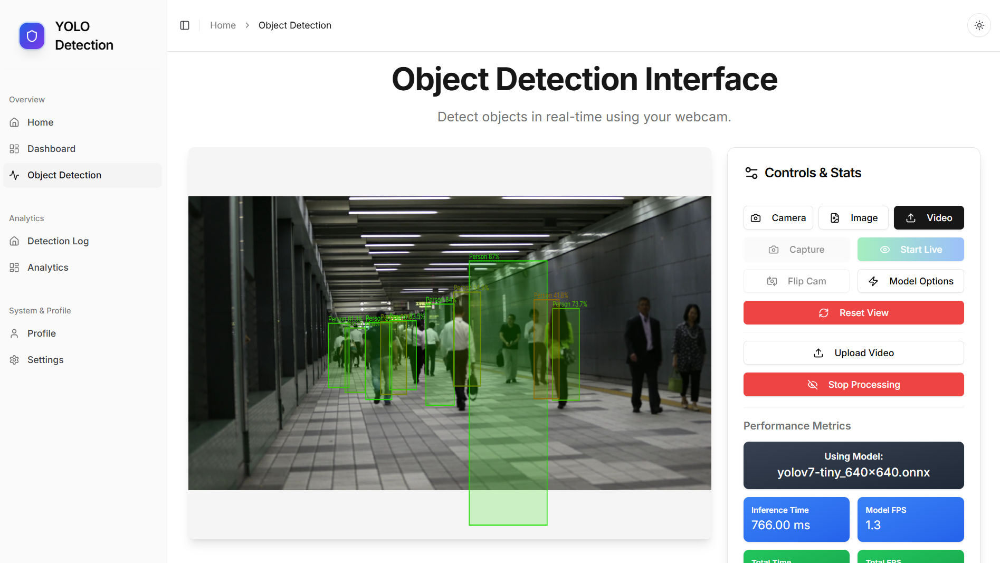

# YOLOv11 Pest Detection in Agriculture

This project is a web-based application for real-time pest detection on plants using a custom-trained YOLOv11 model. It provides an accessible tool for farmers and agriculturists to quickly identify insect pests from a webcam feed, an uploaded image, or a video file.



## Tech Stack

*   **Frontend**: [Next.js](https://nextjs.org/), [React](https://reactjs.org/), [TypeScript](https://www.typescriptlang.org/), [Tailwind CSS](https://tailwindcss.com/)
*   **Object Detection Model**: [YOLOv11](https://github.com/ultralytics/ultralytics) (custom trained)
*   **Web Inference**: [ONNX Runtime Web](https://onnxruntime.ai/docs/tutorials/web/)

## Dataset

The model was trained on the "Insect Pest Detection in Agriculture using YOLO" dataset from Kaggle. This dataset contains images of various agricultural pests, annotated for object detection tasks.

-   **Dataset Link**: [https://www.kaggle.com/datasets/shivamsopanmahajan/insect-pest-detection-in-agriculture-using-yolo-11](https://www.kaggle.com/datasets/shivamsopanmahajan/insect-pest-detection-in-agriculture-using-yolo-11)

## Model Training

We used transfer learning on a pre-trained YOLOv11 model (`yolo11n.pt`). The training was performed using the `ultralytics` library.

### Training Code

The following Python code was used for training the model:

```python
# Install necessary packages
!pip install -U ultralytics
!pip install wandb==0.16.5
!wandb disabled

from ultralytics import YOLO

# Load a pretrained YOLOv11 nano model
model = YOLO('yolo11n.pt')

# Train the model on the custom dataset
model.train(data='/kaggle/input/insect-pest-detection-for-yolo/data.yaml', imgsz=640, seed=42, epochs=100)
```

## Model Conversion for Web

To run the model efficiently in the browser, the trained PyTorch model was converted to the ONNX format and then optimized for the ONNX Runtime WebAssembly.

### Conversion Steps

1.  **Export to ONNX**: The trained YOLO model is first exported to the standard ONNX format.

    ```python
    from ultralytics import YOLO

    # Load your trained model
    model = YOLO("path/to/your/trained/model.pt") # e.g., yolov11n_custom.pt

    # Export the model to ONNX format
    model.export(format="onnx", simplify=True, dynamic=True)
    ```

2.  **Optimize for ONNX Runtime Web**: The exported `.onnx` model is then converted to the `.ort` format, which is optimized for web assembly.

    ```bash
    # Install onnxruntime
    pip install onnxruntime

    # Run the conversion tool
    python -m onnxruntime.tools.convert_onnx_models_to_ort yolov11n_custom.onnx --save_optimized_onnx_model
    ```
    This command generates `yolov11n_custom.ort` and `yolov11n_custom.optimized.onnx`. Either of these can be used in the web application.

## Web Interface

The application provides a clean and intuitive interface for performing object detection.

*   **Input Options**: Users can choose between using their live webcam feed, uploading a static image, or uploading a video file.
*   **Real-time Detection**: The model processes the input in real-time (for webcam and video) and overlays bounding boxes on detected pests.
*   **Controls & Performance**: The interface includes controls to start/stop processing, switch models, and view performance metrics like inference time and frames per second (FPS).

## Getting Started

Follow these steps to set up and run the project locally.

1.  **Clone the repository**:
    ```bash
    git clone https://github.com/CubeStar1/yolo-object-detection.git
    ```

2.  **Navigate to the project directory**:
    ```bash
    cd yolo-object-detection
    ```

3.  **Install dependencies**:
    ```bash
    npm install
    ```

4.  **Run the development server**:
    ```bash
    npm run dev
    ```

5.  **Open the application**:
    Open your web browser and navigate to `http://localhost:3000` to view the application.