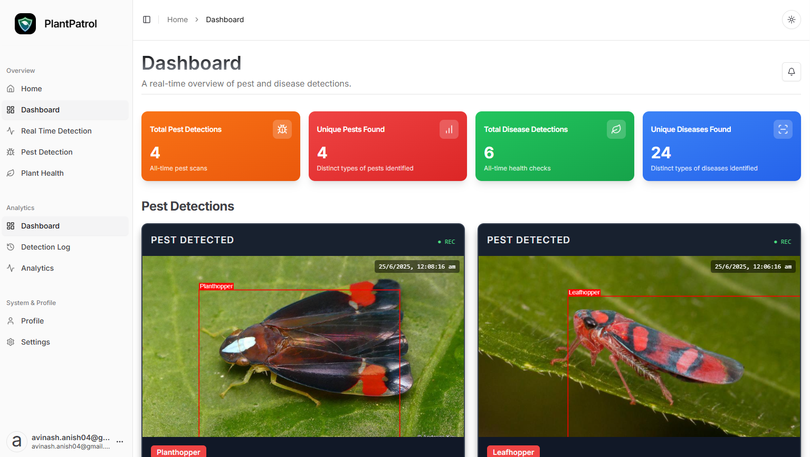
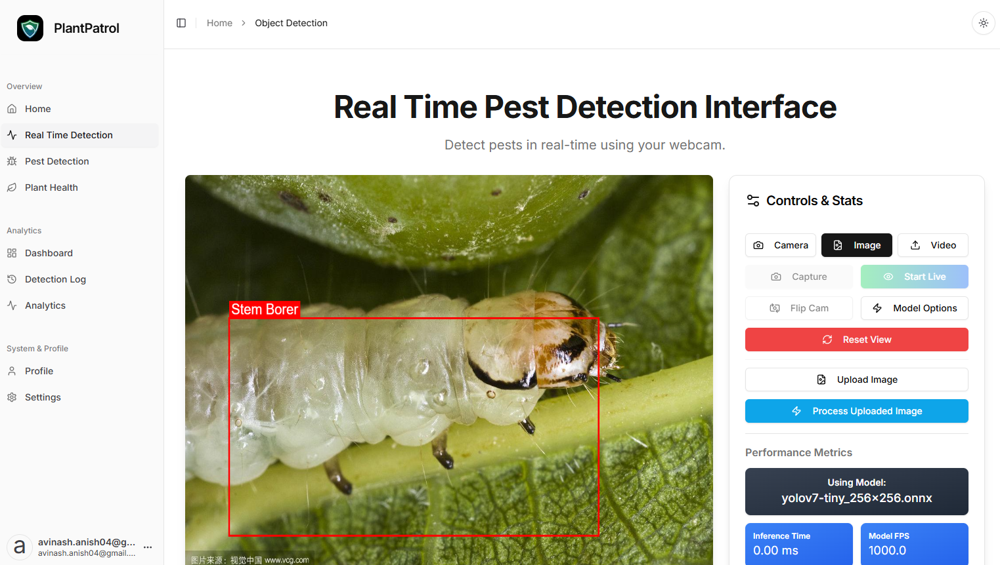
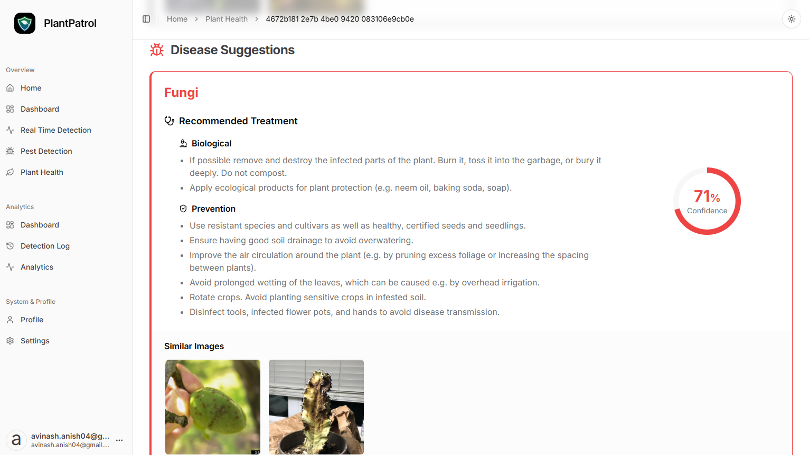
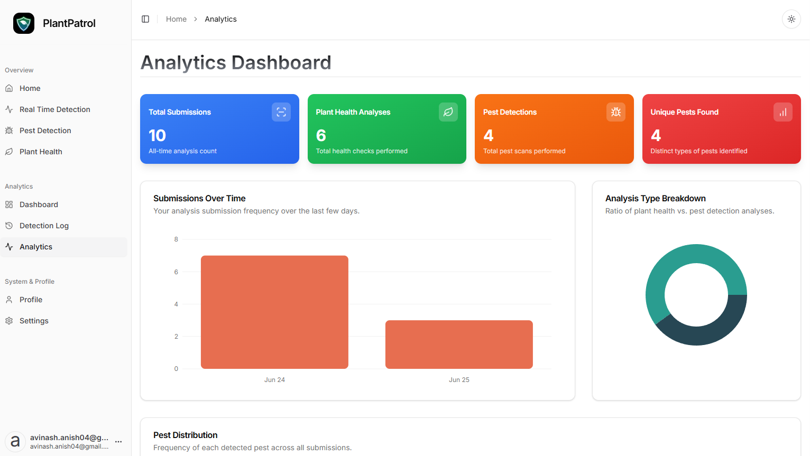
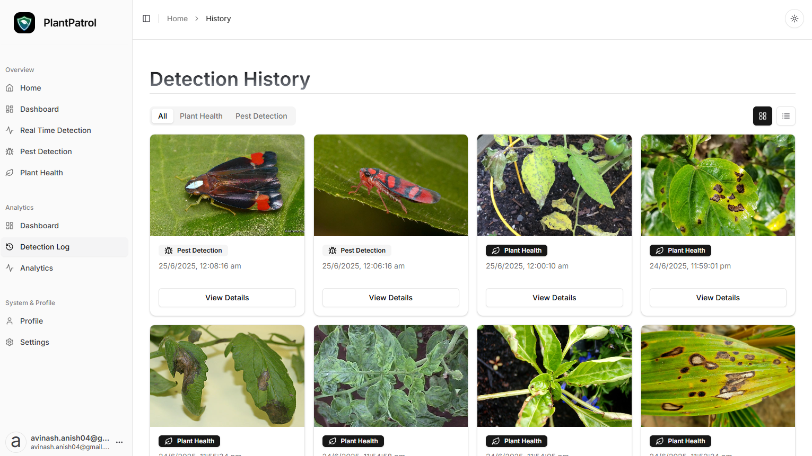
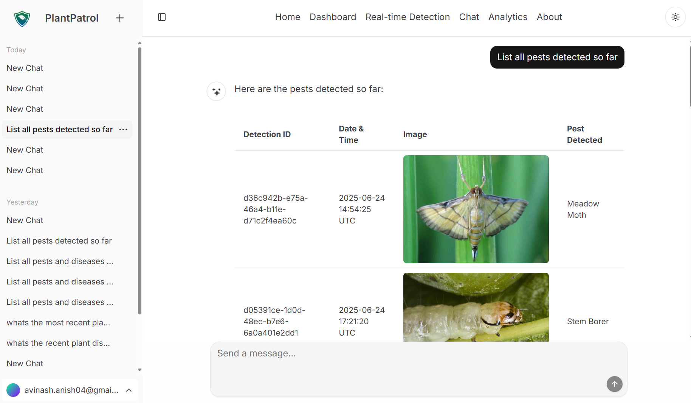
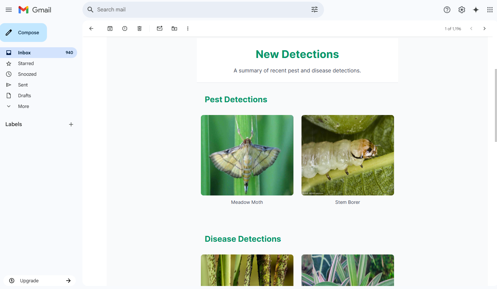

# PlantPatrol: Intelligent Pest & Disease Detection using YOLOv11

PlantPatrol is a comprehensive, AI-powered web platform designed to provide real-time pest detection and in-depth plant health analysis for the agricultural sector. By leveraging advanced computer vision models and a modern web interface, it empowers users to monitor crops, identify threats, and make data-driven decisions to protect their yields.



## Key Features

PlantPatrol offers a suite of powerful tools to help you stay ahead of pests and diseases:

### Real-time Pest Detection

Connect a live camera feed and get instant pest identification. Our system uses a fine-tuned YOLO model to detect and classify pests in real-time, providing immediate insights.



### Plant Health Analysis

Upload an image of a plant to receive a detailed health assessment. The system identifies potential diseases, provides information about them, and suggests possible treatments.



### Analytics Dashboard

Visualize your data in a powerful and intuitive dashboard. Track detection frequencies, monitor trends over time, and gain a comprehensive overview of your crop health.



### Comprehensive Detection Logs

All pest detections and plant health analyses are automatically saved. Review historical data, view original images, and track the timeline of events in a detailed, filterable log.



## Chat with PlantPatrol

PlantPatrol also features a chat interface that allows users to interact with the system and receive personalized recommendations based on their specific needs.



### Alert System

Receive instant alerts when pests are detected or plant health issues are identified. The system sends email notifications to the user's registered email address, providing immediate insights and recommendations.



## Tech Stack

*   **Frontend**: [Next.js](https://nextjs.org/), [React](https://reactjs.org/), [TypeScript](https://www.typescriptlang.org/), [Tailwind CSS](https://tailwindcss.com/), [Resend](https://resend.com/)
*   **Object Detection Model**: [YOLOv11](https://github.com/ultralytics/ultralytics) (custom trained)
*   **Web Inference**: [ONNX Runtime Web](https://onnxruntime.ai/docs/tutorials/web/)

## Dataset

The model was trained on the "Insect Pest Detection in Agriculture using YOLO" dataset from Kaggle. This dataset contains images of various agricultural pests, annotated for object detection tasks.

-   **Dataset Link**: [https://www.kaggle.com/datasets/shivamsopanmahajan/insect-pest-detection-in-agriculture-using-yolo-11](https://www.kaggle.com/datasets/shivamsopanmahajan/insect-pest-detection-in-agriculture-using-yolo-11)

## Model Training

We used transfer learning on a pre-trained YOLOv11 model (`yolo11n.pt`). The training was performed using the `ultralytics` library.

### Training Code

The following Python code was used for training the model:

```python
# Install necessary packages
!pip install -U ultralytics
!pip install wandb==0.16.5
!wandb disabled

from ultralytics import YOLO

# Load a pretrained YOLOv11 nano model
model = YOLO('yolo11n.pt')

# Train the model on the custom dataset
model.train(data='/kaggle/input/insect-pest-detection-for-yolo/data.yaml', imgsz=640, seed=42, epochs=100)
```

## Model Conversion for Web

To run the model efficiently in the browser, the trained PyTorch model was converted to the ONNX format and then optimized for the ONNX Runtime WebAssembly.

### Conversion Steps

1.  **Export to ONNX**: The trained YOLO model is first exported to the standard ONNX format.

    ```python
    from ultralytics import YOLO

    # Load your trained model
    model = YOLO("path/to/your/trained/model.pt") # e.g., yolov11n_custom.pt

    # Export the model to ONNX format
    model.export(format="onnx", simplify=True, dynamic=True)
    ```

2.  **Optimize for ONNX Runtime Web**: The exported `.onnx` model is then converted to the `.ort` format, which is optimized for web assembly.

    ```bash
    # Install onnxruntime
    pip install onnxruntime

    # Run the conversion tool
    python -m onnxruntime.tools.convert_onnx_models_to_ort yolov11n_custom.onnx --save_optimized_onnx_model
    ```
    This command generates `yolov11n_custom.ort` and `yolov11n_custom.optimized.onnx`. Either of these can be used in the web application.


## Getting Started

Follow these steps to set up and run the project locally.

### 1. Clone the Repository

```bash
git clone https://github.com/CubeStar1/plant-patrol.git
cd plant-patrol
```

### 2. Install Dependencies

```bash
npm install
```

### 3. Set Up Supabase Database

- Create a new Supabase project at [Supabase](https://supabase.com/).
- Copy the migration file contents from `lib/supabase/migrations` to your Supabase project SQL editor.
- Run the migrations.
- Get the Supabase URL, anon key, and admin key from your Supabase project settings.

### 4. Set Up Environment Variables

Create a `.env` file in the root of the project and add the following environment variables. You will need to get these keys from their respective services.

```bash
cp env.example .env
```

```env
# Supabase
NEXT_PUBLIC_SUPABASE_URL=<your_supabase_url>
NEXT_PUBLIC_SUPABASE_ANON_KEY=<your_supabase_anon_key>
NEXT_PUBLIC_SUPABASE_ADMIN=<your_supabase_admin_key>

# Resend
NEXT_PUBLIC_RESEND_API_KEY=<your_resend_api_key>
NEXT_PUBLIC_RESEND_DOMAIN=<your_resend_domain>

# App
NEXT_PUBLIC_APP_NAME="PlantPatrol"
NEXT_PUBLIC_APP_ICON='/plantpatrol-logo.png'

# AI
NEXT_PUBLIC_GEMINI_API_KEY=<your_gemini_api_key>
NEXT_PUBLIC_GOOGLE_API_KEY=<your_google_api_key>

# Kindwise
NEXT_PUBLIC_KINDWISE_API_KEY=<your_kindwise_api_key>


# OpenAI
NEXT_PUBLIC_OPENAI_API_KEY=<your_openai_api_key>


```

### 5. Run the Development Server

```bash
npm run dev
```

### 6. Open the Application

Open your web browser and navigate to `http://localhost:3000` to view the application.